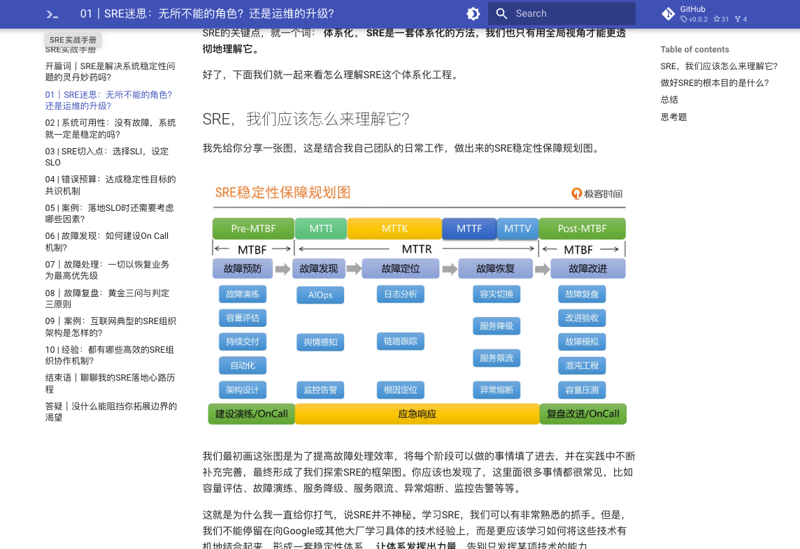

## 极客时间文档

极客时间 markdown & pdf 文档

----

* 看 markdown文档，推荐: https://github.com/uaxe/geektime-docs 🌟🌟🌟
* 看 pdf文档，推荐: https://github.com/uaxe/geektime-pdfs 🌟🌟🌟
* 看 音视频，推荐: https://github.com/zkep/mygeektime 🌟🌟🌟🌟🌟


### markdown 文档

```shell
git clone https://github.com/uaxe/geektime-docs.git  --depth 1

pip install mkdocs-material

cd geektime-docs/后端-架构/说透中台/

mkdocs serve
```

浏览器访问：<http://127.0.0.1:8000/>




### 根据markdown文档本地生成pdf文档
```shell
git clone https://github.com/uaxe/geektime-docs.git

cd geektime-docs

pip install -r requirements.txt

# -i 参数是你需要生成pdf课程的目录
python3 main.py pdf -i 后端-架构/etcd实战课

# 执行完成后，确认最终的pdf是否正常，尤其关注图片
# 建议对照markdown文档检查，如果有问题，欢迎提交 issue
```

### 本项目markdown文档全部由[mygeektime](https://github.com/zkep/mygeektime)生成